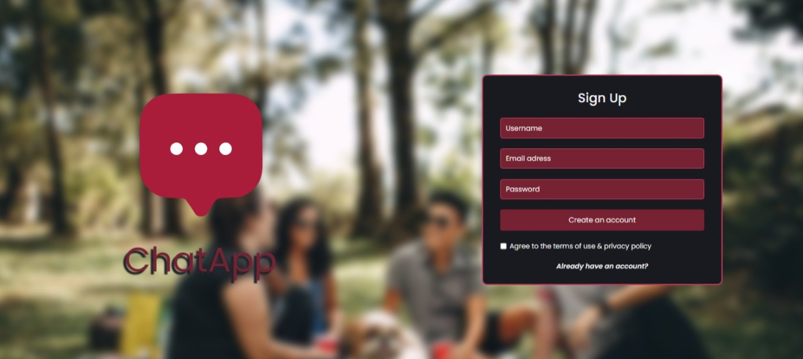
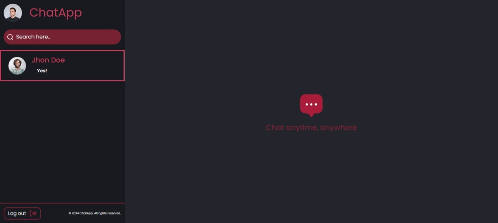
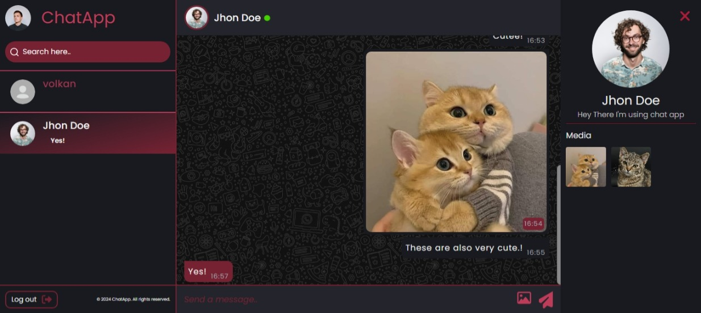
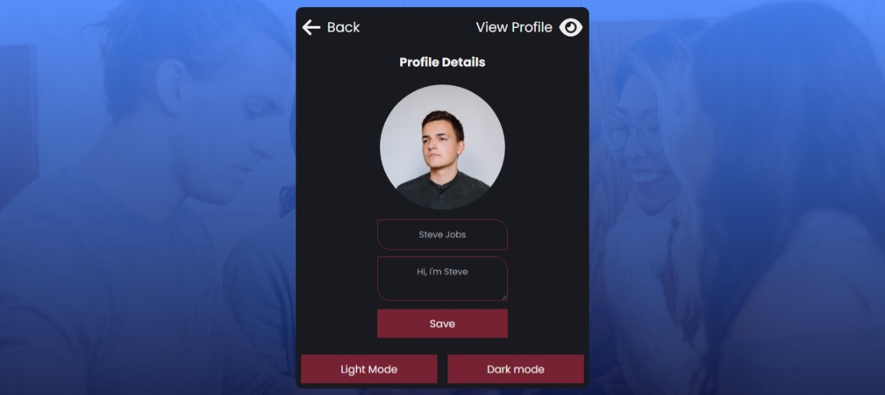
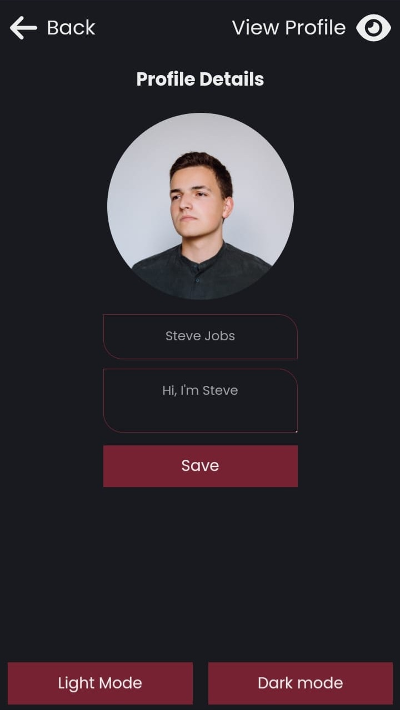
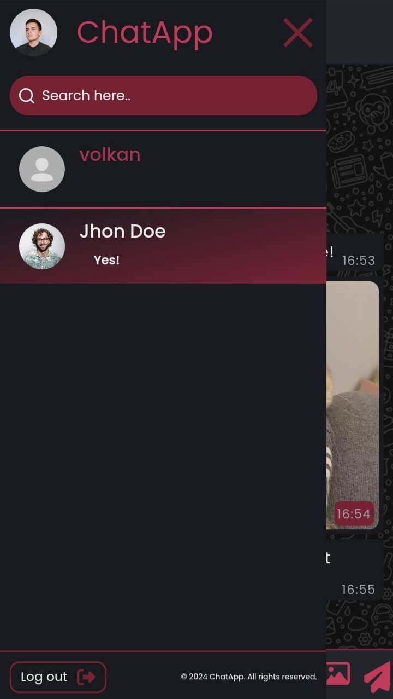
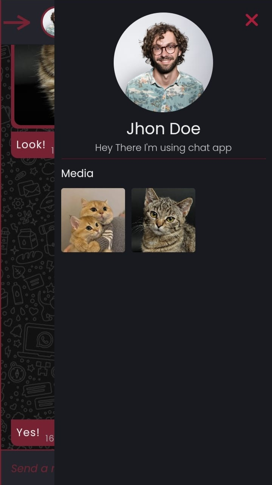

# Chat Application

A real-time chat application built with **Firebase** and **React.js**. Users can chat with others, send and receive messages, and view their online status.

---

## Features

- **Real-Time Messaging**: Messages are updated instantly using **Firebase Realtime Database**.
- **User Registration and Login**: Account creation and authentication are handled via **Firebase Authentication**.
- **Online Status Tracking**: Displays users' online status using the `lastSeen` field.

---

## Screenshots

<div style="display: flex; gap: 8px;">
  
  
  
  
</div>

---

## Technologies Used

- **Frontend**: React.js
- **Backend**: Firebase
  - Firebase Realtime Database
  - Firebase Authentication

---

## Installation Guide

Follow the steps below to set up the application:

1. **Clone this repository**:

   ```bash
   git clone https://github.com/Volkanmolla42/fullStack-chat-app.git
   cd fullStack-chat-app
   ```

2. **Install dependencies**:

   ```bash
   npm install
   ```

3. **Set up Firebase Configuration**:
   Create a `.env` file in the root directory and add the following environment variables:

   ```env
   VITE_FIREBASE_API_KEY=YOUR_API_KEY
   VITE_FIREBASE_AUTH_DOMAIN=YOUR_AUTH_DOMAIN
   VITE_FIREBASE_PROJECT_ID=YOUR_PROJECT_ID
   VITE_FIREBASE_STORAGE_BUCKET=YOUR_STORAGE_BUCKET
   VITE_FIREBASE_MESSAGING_SENDER_ID=YOUR_MESSAGING_SENDER_ID
   VITE_FIREBASE_APP_ID=YOUR_APP_ID
   ```

4. **Run the application**:
   ```bash
   npm run dev
   ```

---

## Usage Instructions

1. **Register or Login**:
   Create a user account or log in with your existing credentials.

2. **Search and Chat**:
   Search for other users by username and start chatting with them.

3. **Check Online Status**:
   View the online status of users in real-time while messaging.

---

## Mobile Support

The application is fully responsive and optimized for mobile devices. Below are some mobile UI screenshots:

<div style="display: flex; gap: 8px;">
  
  
  
  
  
</div>

---

## License

This project is licensed under the [MIT License](LICENSE).
