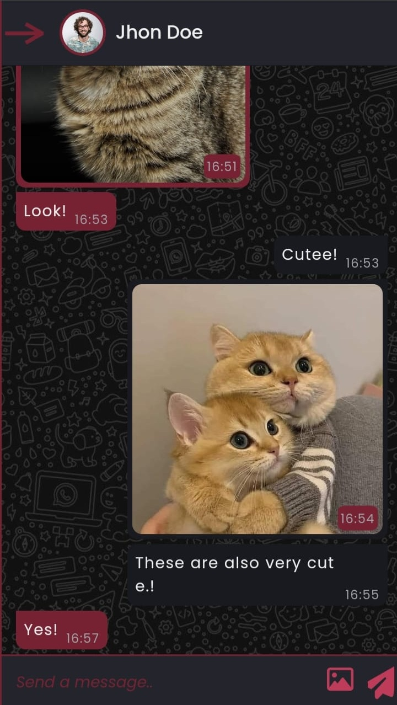
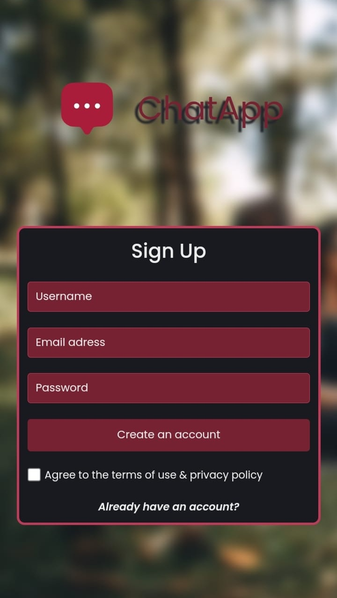

# Chat Application

This project is a real-time chat application developed using Firebase and React.js. Users can chat with others, send and receive messages, and view their online status.

## Features

- **Real-Time Messaging**: Messages are updated in real-time using Firebase Realtime Database.
- **User Registration and Login**: User registration and login can be done using Firebase Authentication.
- **Online Status Display**: Users' online statuses are tracked using the `lastSeen` field.

## Technologies

- **Frontend**: React.js
- **Backend**: Firebase
  - Firebase Realtime Database
  - Firebase Authentication

## Installation

1. Clone this repository:
   ```bash
   git clone https://github.com/Volkanmolla42/fullStack-chat-app.git
   cd fullStack-chat-app
   ```
2. Install the required dependencies:

   ```bash
   npm install
   ```

3. Create `.env` file and add your Firebase configuration:

VITE_FIREBASE_API_KEY= YOUR_API_KEY,
VITE_FIREBASE_AUTH_DOMAIN= YOUR_AUTH_DOMAIN,
VITE_FIREBASE_PROJECT_ID= YOUR_PROJECT_ID,
VITE_FIREBASE_STORAGE_BUCKET= YOUR_STORAGE_BUCKET
VITE_FIREBASE_MESSAGING_SENDER_ID= YOUR_MESSAGING_SENDER_ID
VITE_FIREBASE_APP_ID = YOUR_APP_ID

````

4. Start the application:
```bash
npm run dev
````

## Usage

- Create a user account or log in.
- Search for other users with username and chat with them.
- View your online status while messaging.

## Mobile support





## License

This project is licensed under the [MIT License](LICENSE).
